# Simple SWGOH PO autorotate Shard Bot


## Configuration

### Set environment variables:


|Variable Name| Description                             | Notes |
|-------------|-----------------------------------------|------ |
|botToken | Bot Token  -  - check number #10      | Required|
|channelIdShard| Discord id of the channel where you want to have the bot showing the PO for your members - check number #12|  Required|
|channelIdPest| Discord id of the channel where you want to have the bot showing the PO for your pest/enemies - check number #12| Required|
|thumbnail | Here you can put an image/avatar of the bot. If you don't want to have an avatar just put ' '| Required|
|url | the url of the heroku page. you can get it by pressing on the open app on top right of this page| Required|
|timePeriod | how often the bot should refresh the PO - check number #13| Required|


## Deploy with Heroku steps
### 0. Delete previously created application(if you have one) on github

### 1. Create your own github account (in case you don't have one) and fork this project to your github repository

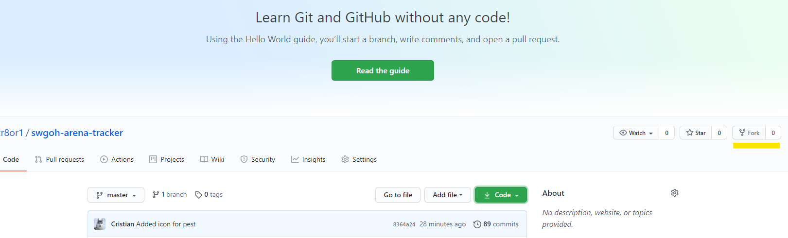

### 2. Click the button below

[](https://dashboard.heroku.com/new-app?template=)

### 3. Create the application with a unique name and press `Create app` button

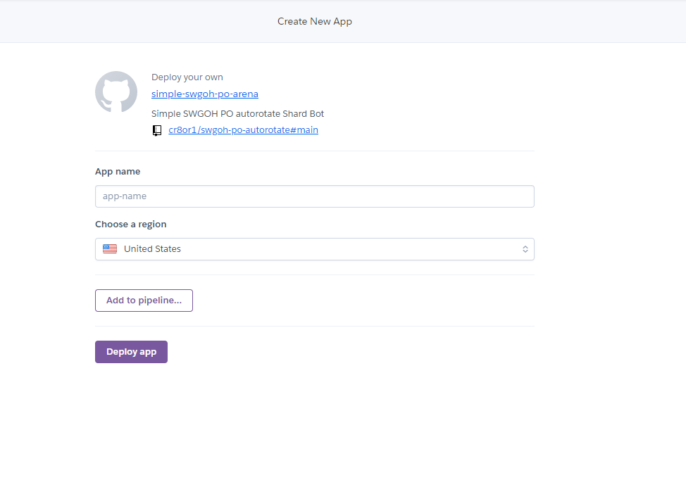


### 4. Once you created the app you need to connect with your github account

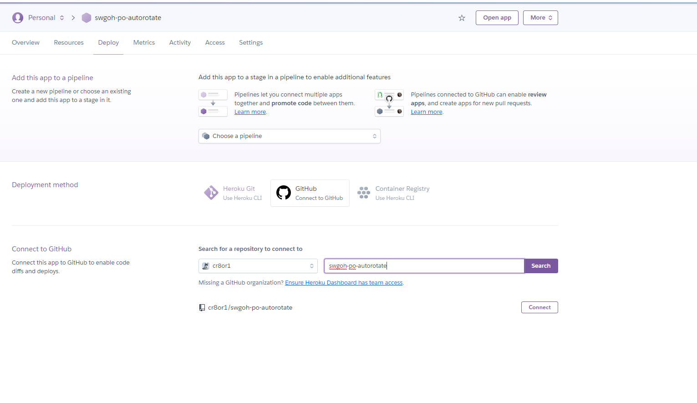

### 5. After you successfully connected you can deploy on heroku by pressing `Deploy Branch` button

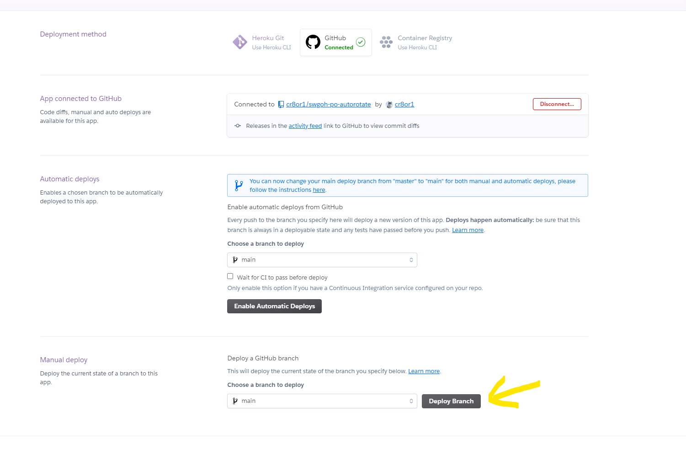

### 6. Go to settings tab

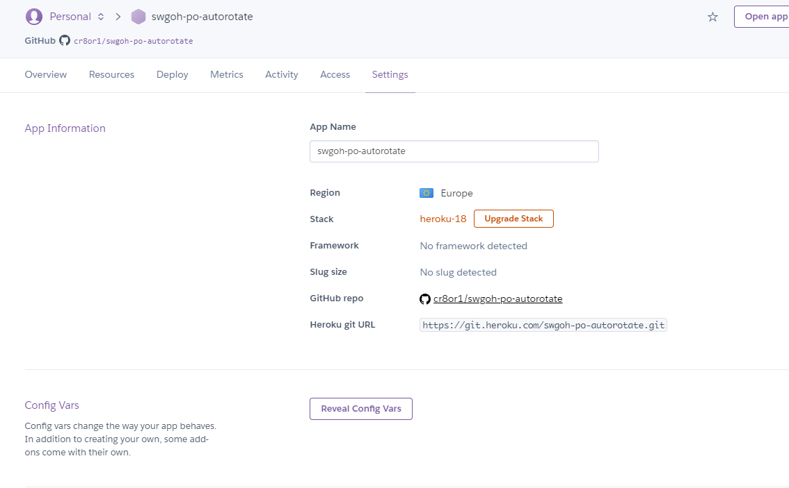

### 7. Press `Reveal Config Vars` button and set environment variables

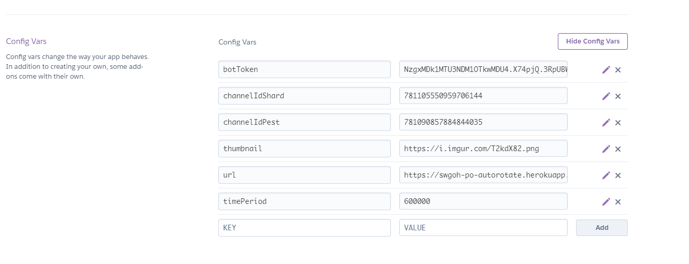

### 8. Create a discord bot and invite it to your shard discord server

Visit [discord developer url](https://discord.com/developers/applications) . Here you will create your own shard bot.

After you login with your discord username and password, you can create a new application.

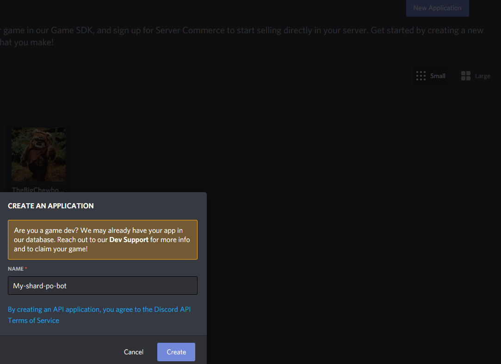

### 9. Create the application bot


### 10. Change the name for your bot or/and upload an avatar. 

Here you will need to copy and save the `bot token` that you need to add it on heroku in `Config Vars`

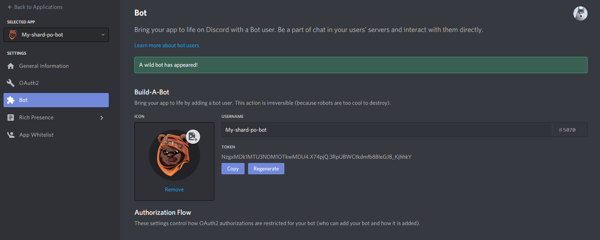

### 11. Invite the bot on your discord server
You can do that by selecting OAuth2 from the menu and select the `bot` from Scopes selections

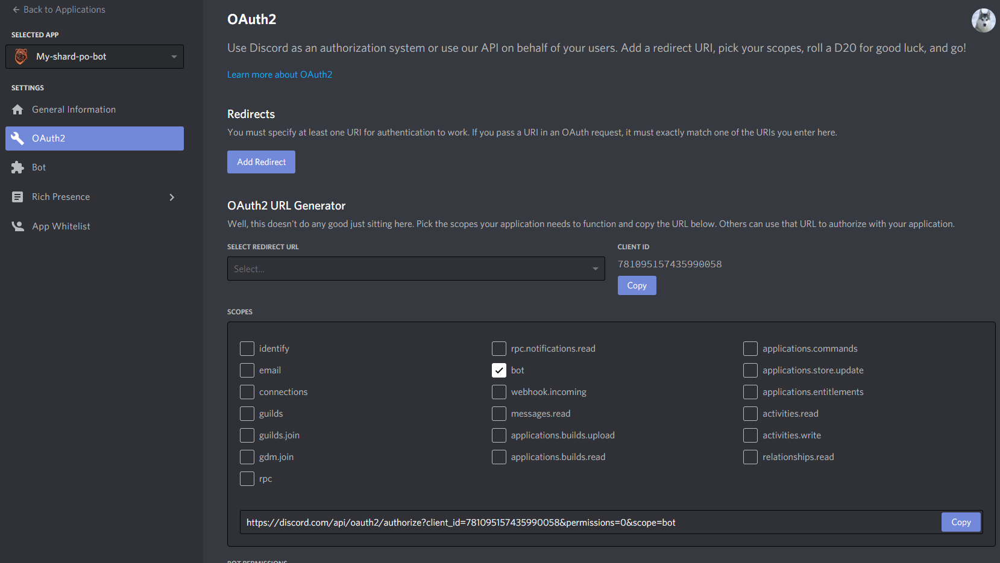

Copy the url and paste it in a new tab where you’ll be prompted to choose which server the bot should join. 
(`!!! You need to be and admin of that server to be able to invite it on that server !!!`)


### 11. MAKE SURE YOU HAVE DEVELOPER MODE ENABLED
You'll find Developer Mode in User Settings > Appearance.

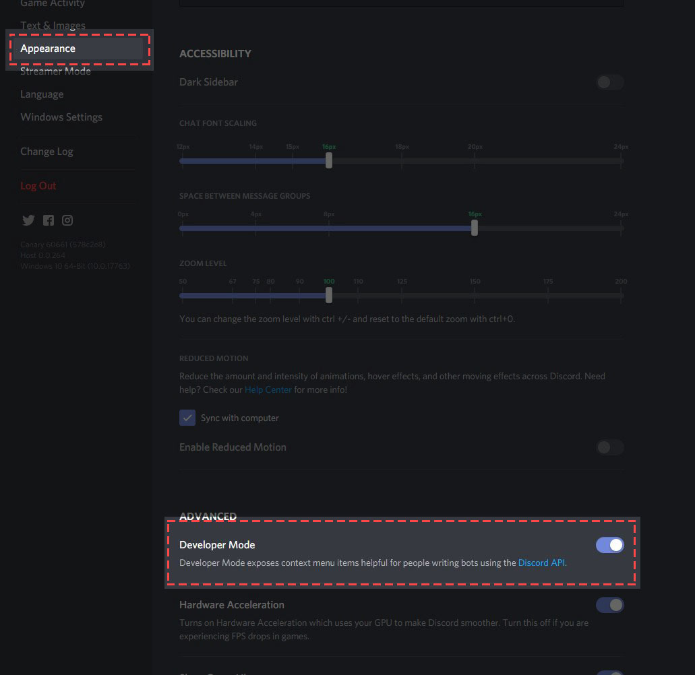

### 12. Copy discord id for each channel where you want the bot to post

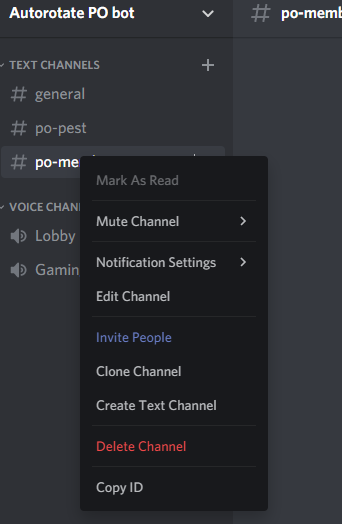

### 13. Time period
Here are some numbers that represent the period of how often the bot should refresh the PO

- 3600000 = every 1 hour
- 1800000 = every 30 min
- 600000 = every 10 min
- 300000 = every 5 min
- 60000 = every 1 min


### 14. Adding PO for members

Modify the ``po-shard-data.json`` file and add the following data:

```json
  {
    "Name": "User 3",
    "Flag": ":flag_us:",
    "SWGOH": "<https://swgoh.gg/p/122235729/>",
    "UTC": "04:00"
  }
```

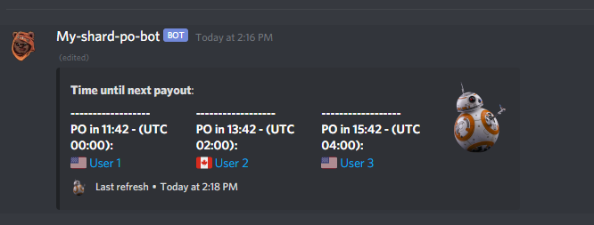

### 15. Adding PO for pest

Same format but you can add a different discord emoji on flag param:

```json
  {
    "Name": "Pest user 3",
    "Flag": ":poop:",
    "SWGOH": "<https://swgoh.gg/p/123456789/>",
    "UTC": "15:00"
  }
```

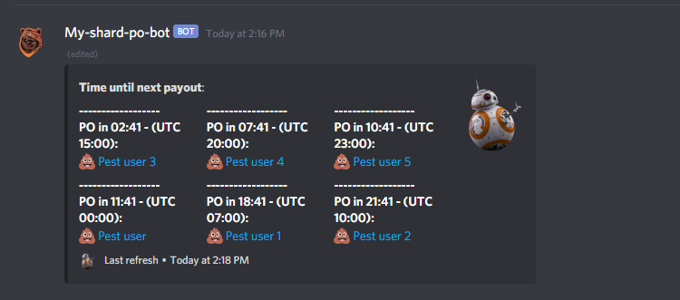

### 16. Keep only one application and one resource at a time, otherwise you will be charged...